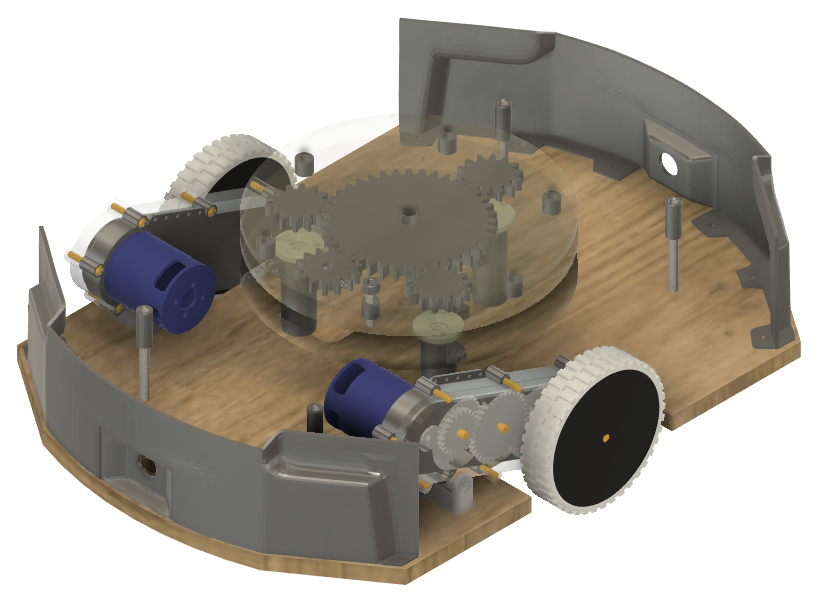
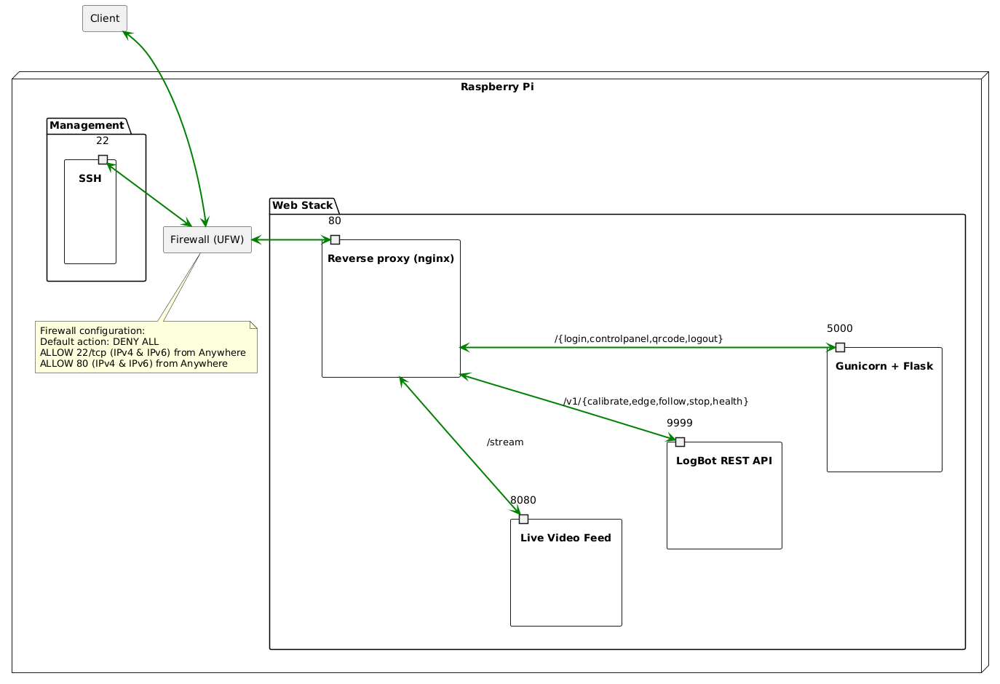

# logbot 🪵🤖 - ELEC-A4010 Sähköpaja

logbot is a logistics robot created as a group project during our first course ELEC-A4010 Sähköpaja at Aalto University during the fall of 2024. The goal of the course is to build a demo of a self-made robotics device with real-world purposes. Our project in particular aims re-create autonomous warehouse robots, which move inventory around using lines on the floor.

Full demo and 3D renders:

[3D Render](./assets/render.png)

[3D Render Video](./assets/render.mp4)

[Full working Demo](./assets/demo.mp4)

## Design

logbot serves a website using a raspberry pi that allows the user to control hardware components on a high level. We also include a keyboard demo, which allows driving logbot as you would in a video game using the WASD keys.

Both the keyboard demo and the website have the following capabilities:

- Calibrating sensors to a line on the floor
- Finding the edge of a line
- Following the edge of a line using a single sensor
- Stopping at will

The logbot website additionally has a video feed, which can be used to read QR Codes. This functionality currently has no purpose, but it is intended to show how logbot could use a real-time data source for navigation.

### Software

logbot's software can be divided into four distinct parts

- Hardware API
- Video Stream
- Website
- Reverse proxy

We use [Rust](https://www.rust-lang.org) for the Hardware API. Specifically we use the [rppal](https://github.com/golemparts/rppal) crate for controlling hardware and the [axum](https://github.com/tokio-rs/axum) web framework for a REST-API. Our hardware requirements were charging rapidly during our development process so all of our core logic is written with very modular abstractions. This means hardware implementations can easily be changed later. For example we support multiple types of motors, each with different control mechanisms using both software and hardware PWM. We enforce extensive rust documentation which can be built using `cargo doc --workspace --no-deps`.

The video stream uses the [picamera2](https://github.com/raspberrypi/picamera2) Python-library to serve a MJPEG stream over HTTP.

The website is themed after Windows XP and built on barebones HTML, CSS and Javascript. The backend is written in Python [flask](https://github.com/pallets/flask) and is served using [gunicorn](https://github.com/benoitc/gunicorn).

We use [nginx](https://github.com/nginx/nginx) as our reverse proxy to combine all of our components into a single service.

When fully configured all services start-up on boot using [systemd](https://systemd.io).

### Hardware

Most of our components are simple robotics parts and can be swapped out easily for different ones and our outer shell is almost entirely 3D printed.

The concrete hardware components used during the course are listed here:

- Raspberry Pi: Raspberry Pi 5B 4GB
- Motors: Turnigy Aerodrive D2836/11 750KV
- Lift Motor: GM4632-370 6V 40rpm
- Sensors: TCRT5000 Infrared Reflective Sensor
- Motor Driver: MD10C R3
- Camera: Raspberry Pi Camera Module 3
- ADC & DAC: Adafruit PCF8591 Quad 8-bit
- Voltage Control: XL4015 Step-Down DC Module

Model files of the components can be found under the `docs/components/` directory.

Information about the GPIO pin connections can be found [here](./docs/PINS.md)

### Network

Our network structure can be visualized with the following [PUML file](./network.puml).

